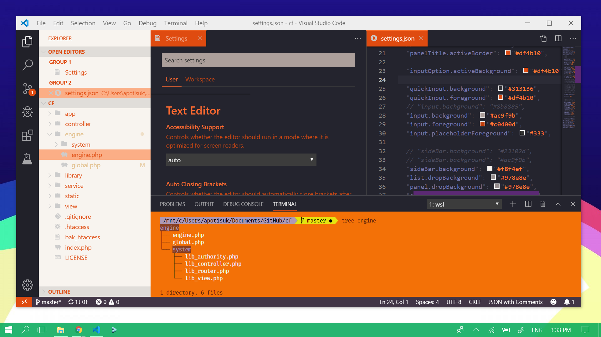

# Operation-Night Cockpit (VSCode Theme Enhancer)
Operation-Night Cockpit enhanced theme which based on other theme by editing settings.json in Visual Studio Code

## Preview

> This syntax theme is: [DuoTone Dark Space](https://marketplace.visualstudio.com/items?itemName=sallar.vscode-duotone-dark)

## Installation
1. Copy `settings.json`
2. In Visual Studio Code, Go to `Setting -> User -> Workbench -> Appearance -> Color Customizations -> Edit in settings.json`
3. Add line `"workbench.colorCustomizations": {}` and placed the copied code inside of it
4. Save the file
